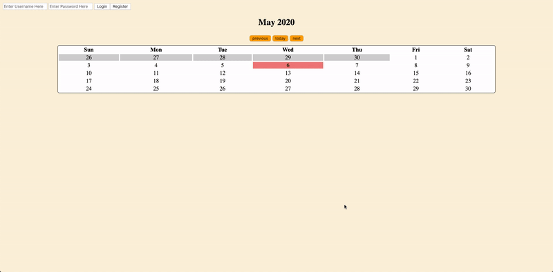

# Calendar Web Application 
This is a Calendar web app built from PHP, MySQL, HTML & CSS, Javascript served originally on an AWS EC2 Instance with Apache. This was an assignment from WashU's CSE330 course – Rapid Prototype Development and Creative Programming, and was done with my partnet Josh Wang.

**Short Demo**

For the full demo video, watch it on [YouTube](https://youtu.be/d2yXIUCw_5o)

**Functionalities**: 
- The calendar is displayed as a table grid with days as the columns and weeks as the rows, one month at a time
- The user can view different months as far in the past or future as desired 
- Events can be added, modified, and deleted 
- Events have a title, date, and time
- Users can log into the site, and they cannot view or manipulate events associated with other users 
- All actions are performed over AJAX, without ever needing to reload the page
- Passwords are stored salted and hashed 

**Security**:
- Safe from XSS attacks; all content is escaped on output 
- Safe from SQL Injection attacks 
- Session cookie is HTTP-Only 
# Link to Calendar: 
http://ec2-18-219-200-46.us-east-2.compute.amazonaws.com/~rick.liu/module5/calendar.php
\
Sample Login Information: \
Username: hihi \
Password: sup
# Creative Portion Description:
In addition to the basic functionalities listed above, we also implemented an additional creative portion. We decided to implement the three suggested functions of tagging, creating group event and sharing events.

**Tags**: There are three tags: school, work, and entertainment for users to choose from when they create a new event. These tags can be selected and deselected when the user edits an event. In addition, there will be three radio buttons at the bottom of the calendar for the user to click on to filter the events. The filtering system will allow any event with any of the selected tags to be displayed. For example, an event marked with the tags school and work will be displayed if either tag is clicked at the bottom of the calendar. Similarly, if both school and work tags were selected at the bottom of the calendar to filter, then any events with either tag or both will be displayed. This is achieved through an additional tag column in the events database that may contain the name of the specific tag of the event. When an event is being fetched by calendar.php, any information in the tag column will be passed through and spliced according to the comma that is used to separate the names of the tag and the resulting array of strings will be used to verify if a particular event is tagged. 

**Group event**: When a user chooses to add an event there will be an input box at the bottom of the field that is dedicated for the user to type in the usernames of the users they want to create a group event with (separated by a semicolon for multiple users). No drop-down list of all users using the calendar is used as we do not want to reveal the usernames of all the users for the calendar. If a user included a username in the field, an additional MySQL query with all of the same information (title, description, date, time, tags, and ID of the user who created the event) except for the column of user_ID(which dictates for whom the event will show) will be created. An if statement is included in the code to make sure that the code does not throw an error when nothing is typed in the textfield.

**Share event**: When a user clicks on a specific date that has an event and a dialog appears with the information, it also has three buttons for each event: edit, delete, and share. Clicking share will close the current dialog and open a new dialog where the user can type in the usernames of the users they desire to share this event with. The usernames will also be separated by a semicolon for sharing with multiple users and will be processed with the trim method. Similarly to how individuals are added in a group event, a MySQL query will be executed when the share button is clicked. This query will have everything the same except for the ID of the user that created it. 
